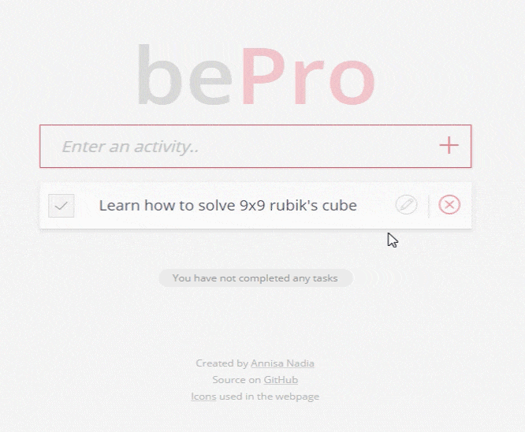

   
   
  
   

<h4 align="center">:memo: A simple to do list webpage to help you be more productive :memo:</h4>

  

---

## Contents

- [Description](#description)
- [How to Use?](#how-to-use)
- [Contributing](#contributing)
- [Authors](#authors)
- [License](#license)

## Description

bePro is a simple to do list built with pure HTML, CSS, and JavaScript. Plan what you want to do and list all of the tasks on this webpage to keep yourself on track with everything you want to do. This project is still currently in development. For now, it can do things like:

<h3 align="center">Add Task</h3>

  

<h3 align="center">Remove Task</h3>

  

<h3 align="center">Checked/ Unchecked Task</h3>

  

<h3 align="center">Edit Task</h3>

  

<h3 align="center">Separate the Uncompleted & Completed Tasks</h3>

  

## How to Use?

You can just go to this [page](), or open in your computer by cloning/ downloading this repo, then double-click/ open the [index.html](https://github.com/annadineyl/bePro/blob/master/index.html) file in your favorite browser.

## Contributing

## Authors
- **Annisa Nadia** - *Initial Work* - [annadineyl](https://github.com/annadineyl) (annisanadianeyla@gmail.com)

## License

 This project is licensed under the GNU GPL 3.0 License - see the [LICENSE.md](https://github.com/annadineyl/bePro/blob/master/LICENSE) file for details